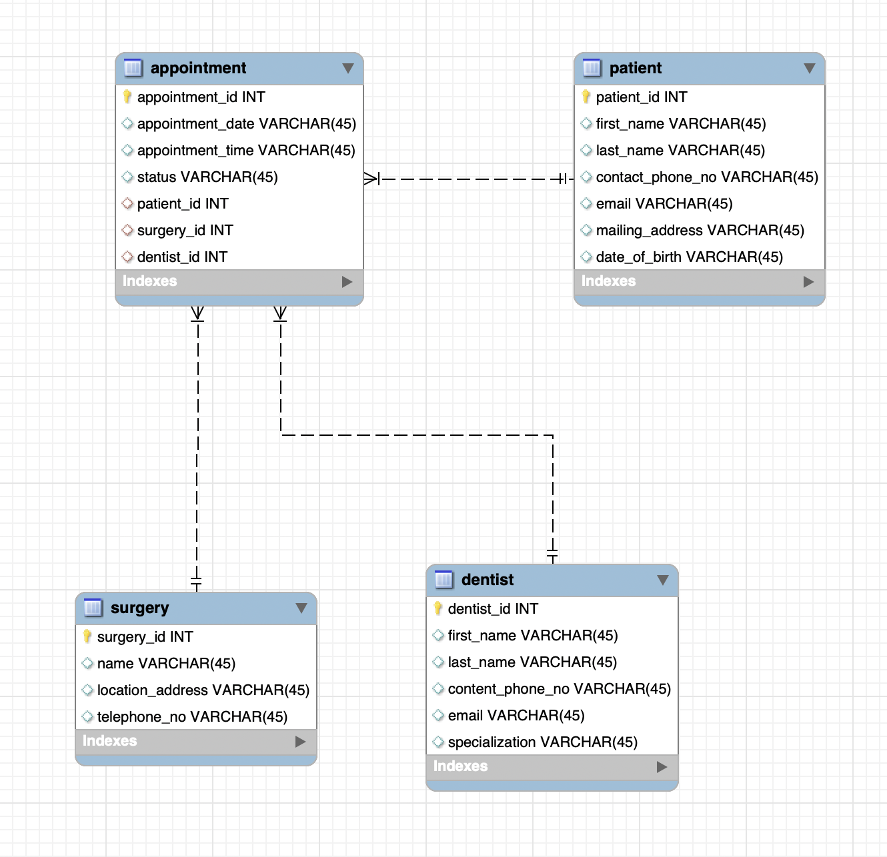

# **Advantis Dental Surgeries (ADS)**

## ER-Diagram

### **Queries**

[myADSDentalSurgeryDBScript.sql](myADSDentalSurgeryDBScript.sql)

### **Tables**

## **Dentist Table**

## **Surgery Table**

## **Patient Table**

## **Appointment Table**

## **Queries**

**Display the list of ALL Dentists registered in the system, sorted in ascending
order of their lastNames**

**Display the list of ALL Appointments for a given Dentist by their dentist_Id
number. Include in the result, the Patient information.** 

**Display the list of ALL Appointments that have been scheduled at a Surgery
Location**

**Display the list of the Appointments booked for a given Patient on a given Date.** 
